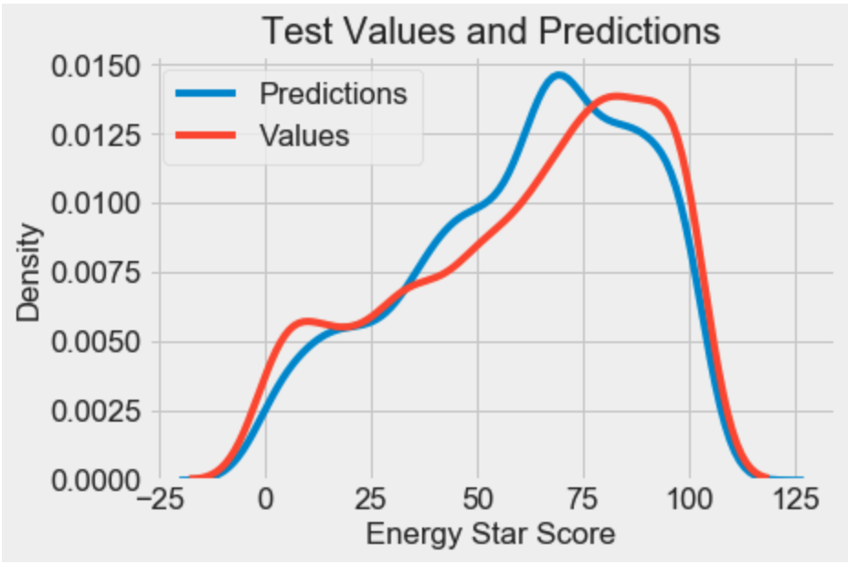

# Building Energy Score Prediction

## Quick Introduction

In this project we are given a dataset containing both numerical and categorical features pertaining to buildings in New York City and we have to come up with a model that can predict a building's Energy Star Score (real valued target variable) 

### Examples of Numerical Features:

    - Gross Floor Area
    - Year Built
    - Site EUI (kBtu/ft²)
    - Weather Normalized Site EUI (kBtu/ft²)
    - District Steam Use (kBtu)
### Examples of Categorical Features:
    - Property Name
    - Street Address
    - Borough
    - Primary Property Type (ex: Office, Hospital e.t.c)

## Problem Statement

Use the provided building energy data to develop a model that can predict a building's Energy Star score, and then interpret the results to find the variables that are most predictive of the score.

## Approach

Although the exact implementation details can vary, I tried to workthrough the problem adhering to this workflow:

Data cleaning and formatting
Exploratory data analysis
Feature engineering and selection
Establish a baseline and compare several machine learning models on a performance metric
Perform hyperparameter tuning on the best model to optimize it for the problem
Evaluate the best model on the testing set
Interpret the model results to the extent possible

## Results

1. Using the given building energy data, a machine learning model can predict the Energy Star Score of a building to within 10 points.
2. The most important variables for determining the Energy Star Score are the Energy Use Intensity, Electricity Use Intensity, and the Water Use Intensity
3. Developed a naive baseline model to compare against 5 machine learning algorithms (Linear/SVM/Random Forest/Gradient Boosting/KNN Regression), used Mean Absolute    Error (MAE) as evaluation metric.
4. Gradient Boosted Regressor performed the best
5. Tuned Hyperparameters using Random Search & 4-fold Cross Validation on the best performing model to predict the Energy Star Score of a building to within 10 points. 

